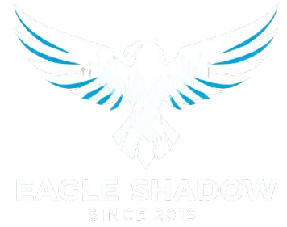
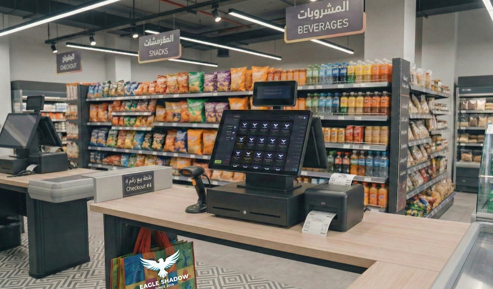
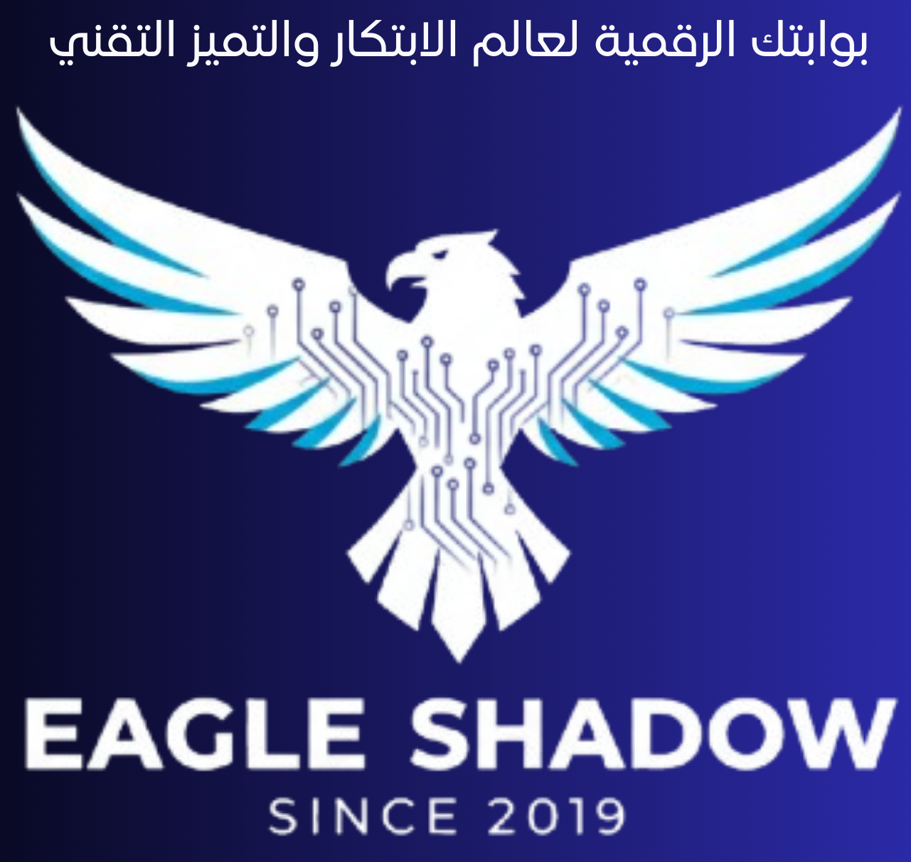

<div align="center">
  
  
  # 🚀 Smart Shop — POS & Store Management System
  ### *The Intelligent, Lightweight, and Portable Retail Engine by EagleShadow Technology*
  
  [](https://microsoft.com)
  [](https://php.net)
  [](#offline-design)
  [](#licensing-security)

  ---
  
  [**العربية (Arabic Version Below)**](#-سمارت-شوب--نظام-إدارة-المتاجر-ونقاط-البيع-الذكي)
</div>

---

## 📌 Executive Overview

**Smart Shop** is a high-performance, commercial-grade **Point of Sale (POS)** and retail intelligence platform built to operate entirely offline on Windows machines. Developed by **EagleShadow Technology**, the system transitions retail and wholesale businesses from chaotic paper-based tracking to precise digital orchestration.

Rather than relying on heavy, resource-intensive frameworks like Electron, Smart Shop utilizes a high-efficiency **native C# Launcher (`SmartShopLauncher.exe`)** written in C# 5.0 (guaranteeing out-of-the-box compatibility with the default .NET compilers in Windows) to manage isolated PHP 8.x and MySQL servers in the background.

---

## 📸 Interface Preview
<div align="center">
  <table>
    <tr>
      <td width="50%" align="center">
        <b>🔐 Secure Portal Gateway</b><br/>
        
      </td>
      <td width="50%" align="center">
        <b>📦 Dynamic Inventory Catalog</b><br/>
        
      </td>
    </tr>
  </table>
</div>

---

## 💎 Key Architectural Masterpieces

### 1️⃣ The POS Engine (`pos.php`)
The primary daily workflow terminal is optimized for touchscreens, mobile tablets, and barcode hardware.
* **Instant Processing:** Seamlessly processes handheld barcode scanner queries and camera scans.
* **Payment Flexibility:** Instantly switch between Cash payments and Credit/Installment accounts.
* **Automated Calculators:** Handles real-time tax processing, dynamic percentage/fixed discounts, and delivery fee allocation.
* **UX Enhancements:** Rich audio feedback for successful operations, error alerts, and toggleable visual layouts (Simple vs. Advanced grids).

### 2️⃣ Decision Center & Analytics (`reports.php`)
A powerhouse for managers that moves beyond raw data into descriptive business intelligence.
* **Cash Basis Integrity:** Operates strictly on a Cash Basis accounting model to guarantee that reports match physical drawer register balances.
* **Visual Dashboards:** Leverages locally-rendered Chart.js graphics to map daily, weekly, and monthly revenue vectors and categories.
* **AI Annual Tips Advisor (`AnnualAnalyzer.php`):** Computes store trends over historic intervals and generates prescriptive tips to minimize expenditures and maximize inventory turnover rates.

### 3️⃣ Inventory Control & Recovery (`products.php`, `removed_products.php`)
Complete tracking of merchandise, physical assets, and safety stocks.
* **Smart Low-Stock Alerts:** Visually flags items dropping below designated threshold levels.
* **Bulk Import & Export:** Streamlines operations with mass Excel templates and automated barcode printing.
* **Safety Net Recycle Bin:** Allows rapid restoration of accidentally deleted products via `removed_products.php`.

### 4️⃣ Relationship CRM & Debt Ledger (`customers.php`, `credits.php`)
A secure digital ledger replacing manual notebooks.
* **Client Profiling:** Deep customer tracking, historical balance records, and address directories.
* **Debt Registry (`credits.php`):** Handles complex credit facilities, tracks partial and installment-based payments, and records chronological payment receipts.

### 5️⃣ Financial Auditing Hub (`invoices.php`, `expenses.php`, `refunds.php`)
Maintains perfect commercial accountability.
* **Sales Archive:** Filter, search, and instantly reprint thermal or standard invoice sheets.
* **Expense Ledger:** Logs operating expenses (rent, utilities, salaries) to calculate true net profit.
* **Refund Processor:** Automated inventory restock and cash drawer balance adjustments on refunds.

### 6️⃣ Exclusive Value-Added Features
* **Zakat Calculator (`zakat_calculator.php`):** Computes obligatory Zakat liabilities on commercial goods based on current assets and stock valuation.
* **Customer Display Console (`customer_display.php`):** Operates on a secondary screen to display active shopping carts and pricing to customers.
* **Security & Multi-User (`users.php`):** Granular access controls mapping across three roles: *Administrator*, *Manager*, and *Cashier*.
* **Backup & Restore System (`settings.php`):** Exports data archives into the root `backups` directory with a single click.

---

## 🛠 Tech Stack & Offline Independence

| Component | Technology | Detail |
| :--- | :--- | :--- |
| **Backend Engine** | PHP 8.x | High-performance, memory-optimized local interpretation. |
| **Database** | MySQL | Robust, transactional relational engine. |
| **Frontend Style** | Tailwind CSS | Local CSS compiled from `src/input.css` to `assets/css/style.css` via `npm run build-css`. |
| **C# Desktop Wrapper**| Windows Forms (.NET) | Enforces single-instance mutex and background service orchestration. |
| **Offline Assets** | Static Files | 100% self-hosted libraries (SweetAlert2, JsBarcode, Chart.js, Google Fonts, Material Icons). |

---

## 🖥 C# Launcher Deep Dive (`SmartShopLauncher.cs`)

The C# Launcher serves as the controller for the underlying server infrastructure.

```
+--------------------------------------------------------+
|               Smart Shop Launcher (Mutex)              |
+---------------------------+----------------------------+
|  [Custom STA Thread]      |  [Process Redirection]     |
|  Native SplashScreen      |  DbQueryForm (mysql.exe)   |
+---------------------------+----------------------------+
|  [Background Host Port 8000]                           |
|  PHP Development Server (Suppressed CLI Logs)           |
+--------------------------------------------------------+
|  [Background Host Port 3307]                           |
|  MySQL Daemon Process (Target %APPDATA%/SmartShop/data) |
+--------------------------------------------------------+
```

### 💫 Key Launcher Features:
* **Native Threaded Splash:** A custom splash screen renders on an independent STA thread with dynamic loading steps and an animated progress bar.
* **Global Instance Guard:** Enforces a single-instance policy using a named mutex (`Global\SmartShopLauncherMutex`).
* **Intelligent Logging:** Distinguishes between warnings, system messages (`[MySQL System]`, `[PHP System]`), and critical failures without bloating the developer logs.
* **Safe Shutdown Control:** Prevents accidental termination by blocking window close commands if services are active. It displays a persistent warning to click "Stop System" first.
* **Integrated SQL Console (`DbQueryForm`):** A custom built-in DB Console redirects stdin/stdout streams of `mysql.exe` directly inside a C# Form, avoiding any command prompt flashes.
* **Dynamic Sidebar Design:** Styled with customizable color states where disabled buttons adapt to an RGB gray (`80,80,80`) background and restore their color profiles upon activation.

---

## 📦 Deployment & Compiling Guide

### 📂 Directory Structure Highlights
* `launcher/`: Source scripts for compiler operations and installer configurations.
* `db/`: Stores `smart_shop.sql` database schema blueprints.
* `lang/`: Native translation files (`ar.php` / `fr.php`).
* `tools/`: Automation utilities (`build.php`, `clean_bin.bat`).
* `%APPDATA%\SmartShop\data`: The persistent hidden Windows directory housing the MySQL database files to avoid accidental deletion.

---

### 🚀 Creating the Distribution Build

#### 1. Populate Dependencies
1. Download **PHP 8.x (VS16 x64 Thread Safe)** from [windows.php.net](https://windows.php.net/download/). Extract to `bin\php\`. Ensure `bin\php\php.exe` is present.
2. Download **MySQL Community Server (ZIP Archive)**. Extract to `bin\mysql\`. Ensure `bin\mysql\bin\mysqld.exe` is present.

#### 2. Clean Dev Junk and Compile
Large development files can swell the folder size to over 1.5GB. 
Run `tools/clean_bin.bat` (Run as Administrator). This recursively strips debug symbols, docs, and tests to compress the size below **200 MB**.

#### 3. Build & Compile Desktop Wrapper
To generate the distribution directory, execute the main build utility script:
```bash
build_app.bat
```
This triggers `tools/build.php` to produce the compiled, obfuscated `dist/` directory.

To compile the C# Launcher:
```bash
cd dist
compile_launcher.bat
```
This compiles `SmartShopLauncher.exe` using the system's native compiler `csc.exe` automatically.

---

### 💿 Desktop Packaging Options

To pack Smart Shop into a single distributable:

#### Option A: Professional Setup Wizard (Recommended)
We provide an Inno Setup Compiler configuration file inside `launcher/SmartShop_Setup.iss`.
1. Install [Inno Setup](https://jrsoftware.org/isdl.php).
2. Open `launcher/SmartShop_Setup.iss` in Inno Setup.
3. Build using LZMA2/Ultra64 compression options to output a lightweight single-file setup installer (`SmartShop_Installer.exe`).

#### Option B: Self-Extracting SFX Archive
Using WinRAR SFX with advanced solid configurations:
- **Compression Mode:** RAR, Dictionary Size: 64MB, Method: Best.
- **SFX Options:** Unpack to temporary folder, Run after extraction: `SmartShopLauncher.exe`, Hide All extraction bars, Overwrite all files, Load custom icon: `favicon.ico`.

---

## 🔧 Diagnostics & Troubleshooting

#### 🛑 Error: *"Connection failed: No connection could be made..."*
* **Solution 1 (Missing Runtime Libraries):** MySQL requires the MSVC redistribution packages. Install the **Visual C++ Redistributable for Visual Studio 2015-2022** ([x64 Installer](https://aka.ms/vs/17/release/vc_redist.x64.exe)).
* **Solution 2 (Firewall Port Blocks):** Right-click `SmartShop Launcher` or `SmartShop.bat` and select **Run as Administrator** to auto-configure appropriate firewall exemptions.

#### ⚠️ Error: *"Error: Could not find application files"*
Ensure `build_app.bat` has been run and you are compressing the files **inside** the `dist` directory, rather than the parent directory itself.

---

## 📞 Support & Dev Info
Developed with passion by **EagleShadow Technology**.
* **Support Email:** `support@eagleshadow.technology`
* **WhatsApp Tech Support:** `+212 700-979284` (Hamza Saadi)
* **Website:** [eagleshadow.technology](https://eagleshadow.technology)

---
---

<div align="center">
  
  
  # 🚀 سمارت شوب — نظام إدارة المتاجر ونقاط البيع الذكي
  ### *المحرك البرمجي الأكثر كفاءة وخفة وسهولة للنشر من تطوير EagleShadow Technology*
</div>

---

## 📌 نظرة عامة على النظام

نظام **Smart Shop** هو منصة تجارية متكاملة وعالية الأداء لإدارة **نقاط البيع (POS)** والمبيعات، مصممة بالكامل للعمل دون الحاجة للاتصال بالإنترنت (Offline 100%) على أنظمة التشغيل Windows. النظام من تطوير **EagleShadow Technology**، ويعد الشريك الرقمي الأمثل لنقل المتاجر والأنشطة التجارية من الإدارة الورقية التقليدية إلى الدقة والاحترافية الرقمية.

بدلاً من الاعتماد على الأطر البرمجية الثقيلة والمستهلكة للموارد مثل Electron، يعتمد النظام على برنامج تشغيل أصلي مكتوب بلغة **C# 5.0 (`SmartShopLauncher.exe`)** متوافق كلياً مع نظام ويندوز ومترجمه الافتراضي `csc.exe` دون تطلب منصات إضافية، ويقوم بتشغيل خوادم معزولة لـ PHP 8.x وقاعدة بيانات MySQL في الخلفية بكل كفاءة وسلاسة.

---

## 💎 أبرز المكونات البرمجية والوحدات المتكاملة

### 1️⃣ وحدة نقطة البيع السريعة (`pos.php`)
الواجهة الأساسية واليومية للمبيعات، متوافقة كلياً مع الشاشات اللمسية، الأجهزة اللوحية، وأجهزة قراءة الباركود.
* **سرعة فائقة:** تدعم قراءة الباركود فوراً عبر الماسح اليدوي أو كاميرا الجهاز.
* **خيارات دفع متعددة:** إمكانية التحويل بضغطة زر بين الدفع النقدي (Cash) والدفع الآجل (الكريدي).
* **حسابات آلية دقيقة:** حساب تلقائي للضرائب، والخصومات (المئوية أو الثابتة)، وتكلفة التوصيل.
* **تفاعل متميز:** توفير مؤثرات صوتية لنجاح العمليات أو فشلها وتدعم وضعي عرض (مبسط للمحلات الصغيرة ومتطور).

### 2️⃣ لوحة التحكم والتحليل المالي لمتخذي القرار (`reports.php`)
أداة قوية للإدارة تساعد في اتخاذ القرارات وحساب الأرباح بناءً على تحليل عميق وليس فقط عرض البيانات.
* **مبدأ الأساس النقدي:** يعتمد النظام محاسبياً على "الأساس النقدي" لضمان تطابق الأرباح المسجلة مع النقد الفعلي المتواجد بالخزنة.
* **رسومات بيانية تفاعلية:** استخدام مكتبة Chart.js محلية بالكامل لعرض إحصاءات المبيعات اليومية، الأسبوعية، والشهرية، وتصنيف المبيعات حسب الفئات.
* **مستشار النصائح السنوية (`AnnualAnalyzer.php`):** أداة مبتكرة تقوم بتحليل البيانات التاريخية للمبيعات وتقديم نصائح تجارية مخصصة لتقليل النفقات وزيادة دوران المخزون.

### 3️⃣ إدارة المنتجات والمخزون وسلة الاسترداد (`products.php`، `removed_products.php`)
التحكم الشامل بجميع بضائع وأصول المتجر.
* **تنبيهات انخفاض المخزون:** تنبيه تلقائي ملون للمنتجات التي تقترب من النفاد أو وصلت للحد الأدنى.
* **استيراد وتصدير سريع:** دعم استيراد المنتجات جماعياً عبر ملف Excel وطباعة ملصقات الباركود بسهولة.
* **سلة المحذوفات الذكية:** ميزة حماية لاسترجاع أي منتج تم حذفه بالخطأ من خلال صفحة `removed_products.php`.

### 4️⃣ إدارة العملاء ودفتر الديون الرقمي (`customers.php`، `credits.php`)
البديل العصري والآمن للدفاتر الورقية لضمان الحقوق المالية ومتابعة العملاء.
* **سجل العملاء:** قاعدة بيانات متكاملة لمعلومات العملاء، تتبع معاملاتهم وحساباتهم.
* **دفتر الكريدي الرقمي (`credits.php`):** تسجيل الديون، وتتبع السداد الجزئي أو على أقساط، مع أرشيف تفصيلي وتواريخ لعمليات السداد.

### 5️⃣ وحدة التدقيق المالي وفواتير المبيعات (`invoices.php`، `expenses.php`، `refunds.php`)
ضبط التدفقات النقدية والحد من الخسائر غير المرئية.
* **أرشيف الفواتير:** بحث متقدم وإعادة طباعة الفواتير الحرارية أو الفواتير العادية في أي وقت.
* **جدول المصاريف:** تتبع النفقات التشغيلية (إيجار، فواتير كهرباء، رواتب) لخصمها والحصول على صافي الربح الحقيقي.
* **إدارة المرتجعات:** معالجة إرجاع السلع مع إعادة تهيئة تلقائية للمخزون وخزينة المال.

### 6️⃣ المزايا الحصرية الفريدة
* **حاسبة الزكاة الذكية (`zakat_calculator.php`):** ميزة فريدة تحسب مقدار زكاة عروض التجارة المستحقة بناءً على قيمة البضائع النشطة والسيولة المالية المتوفرة.
* **شاشة العرض الإضافية للزبون (`customer_display.php`):** شاشة ثانية مستقلة تظهر للعميل تفاصيل السلع الممسوحة ضوئياً والأسعار الإجمالية أثناء عملية البيع لضمان الشفافية.
* **نظام الصلاحيات والأمان (`users.php`):** توزيع المهام بدقة بين ثلاثة مستويات من المستخدمين (مدير عام Admin، مشرف Manager، كاشير Cashier).
* **النسخ الاحتياطي الفوري (`settings.php`):** بنقرة زر واحدة يتم تصدير وحفظ قاعدة البيانات بالكامل داخل مجلد `backups` في جذر البرنامج.

---

## 🛠 التقنيات المستخدمة والعمل المستقل بالكامل (Offline)

| المكون | التقنية المستخدمة | التفاصيل |
| :--- | :--- | :--- |
| **محرك الخلفية** | PHP 8.x | أداء سريع ومثالي مستهلك للحد الأدنى من الذاكرة العشوائية. |
| **قاعدة البيانات** | MySQL | محرك قواعد بيانات قوي، آمن ومعتمد عليه لإدارة المعاملات المالية. |
| **التصميم والواجهات** | Tailwind CSS | تصميم مخصص محلي مترجم من ملف `src/input.css` إلى `assets/css/style.css` عبر الأمر `npm run build-css`. |
| **غلاف سطح المكتب الأصلي** | Windows Forms (.NET) | مشغل ذكي بلغة C# يضمن معالجة تشغيل الخوادم وحظر التكرار. |
| **الاستقلالية وعدم الاتصال** | مكتبات محلية | جميع المكتبات (SweetAlert2، JsBarcode، Chart.js، الخطوط وأيقونات جوجل) مستضافة محلياً 100%. |

---

## 🖥 البنية الهيكلية لمشغل النظام C# Launcher (`SmartShopLauncher.cs`)

يعمل مشغل C# كلوحة قيادة حقيقية لإدارة السيرفرات وقاعدة البيانات وتنسيق العمليات:

```
+--------------------------------------------------------+
|               Smart Shop Launcher (Mutex)              |
+---------------------------+----------------------------+
|  [Custom STA Thread]      |  [Process Redirection]     |
|  Native SplashScreen      |  DbQueryForm (mysql.exe)   |
+---------------------------+----------------------------+
|  [Background Host Port 8000]                           |
|  PHP Development Server (Suppressed CLI Logs)           |
+--------------------------------------------------------+
|  [Background Host Port 3307]                           |
|  MySQL Daemon Process (Target %APPDATA%/SmartShop/data) |
+--------------------------------------------------------+
```

### 💫 المزايا التقنية لمشغل C#:
* **شاشة بدء ذكية مستقلة:** تعمل شاشة الـ Splash Screen في مسار معالجة مستقل (STA thread) مع شريط تقدم متحرك يعرض مراحل تهيئة النظام.
* **حظر التكرار (Single Instance Mutex):** استخدام ميزة الـ Mutex على مستوى النظام باسم (`Global\SmartShopLauncherMutex`) لمنع تشغيل نسختين في نفس الوقت لمنع تداخل قواعد البيانات.
* **فرز وتصنيف السجلات (Logs):** نظام ذكي يعزل الرسائل والتحذيرات الروتينية لـ PHP و MySQL لمنع امتلاء السجل بالأخطاء الوهمية وتسهيل التشخيص للمطورين.
* **منع الإغلاق العشوائي المفاجئ:** لا يسمح البرنامج بإغلاق النافذة أثناء عمل الخوادم لمنع تلف البيانات، ويتطلب من المستخدم الضغط على "Stop System" أولاً لإنهاء العمليات بشكل آمن.
* **منصة استعلامات مدمجة (SQL Console):** شاشة مدمجة بالكامل لتنفيذ استعلامات SQL عبر إعادة توجيه مدخلات ومخرجات ملف `mysql.exe` بشكل صامت ودون ظهور نوافذ الـ CMD السوداء المزعجة للمستخدم.
* **تصميم ديناميكي متجاوب:** يتميز بأزرار تتغير ألوانها ديناميكياً لتتحول إلى اللون الرمادي المتناسق (`80,80,80`) عند إلغاء التفعيل وتستعيد بريقها اللوني بمجرد تفعيلها.

---

## 📦 دليل البناء والترجمة والتوزيع المتقدم

### 📂 أهم مسارات المجلدات
* `launcher/`: يحتوي على الكود المصدري للمشغل وملفات بناء المثبت الاحترافي.
* `db/`: يحتوي على ملف الهيكل المبدئي لقاعدة البيانات `smart_shop.sql`.
* `lang/`: ملفات الترجمة المحلية المعرّبة والمفرنسة (`ar.php` / `fr.php`).
* `tools/`: أدوات المطور للمطابقة والبناء والتنظيف التلقائي.
* `%APPDATA%\SmartShop\data`: المسار السري والمحمي في نظام ويندوز لتخزين ملفات قاعدة البيانات لمنع فقدانها أو حذفها بالخطأ عند تحديث البرنامج.

---

### 🚀 خطوات بناء وتصدير النسخة النهائية

#### 1. تجهيز بيئة التشغيل
1. قم بتحميل نسخة **PHP 8.x (VS16 x64 Thread Safe)** من الموقع الرسمي وموقع التنزيل المباشر [windows.php.net](https://windows.php.net/download/) وفك ضغطها داخل المسار `bin\php\`.
2. قم بتحميل نسخة **MySQL Community Server** وفك ضغطها داخل المسار `bin\mysql\`.

#### 2. تقليص حجم المجلد وتجاوز تضخم الملفات
ملفات خوادم PHP و MySQL الافتراضية تحتوي على سجلات ومستندات تطوير تفوق حجم 1.5 جيجابايت.
لتجاوز ذلك، قم بتشغيل أداة التنظيف والتطهير كمسؤول:
```bash
tools/clean_bin.bat
```
سيقوم هذا الملف بحذف جميع ملفات الاختبار ورموز تصحيح الأخطاء (Debug symbols) لتقليص الحجم الإجمالي إلى **أقل من 200 ميجابايت** فقط!

#### 3. تشغيل معالج البناء والترجمة
لبناء المشروع، توجه للمجلد الرئيسي للمشروع ونفذ معالج البناء:
```bash
build_app.bat
```
سيقوم هذا الملف بتشغيل سكربت `tools/build.php` لإنتاج مجلد `dist` مشفر ومغلق ومستعد للنشر.

لتجميع وترجمة مشغل السي شارب (C# Launcher):
```bash
cd dist
compile_launcher.bat
```
سيقوم هذا الملف باستخدام مترجم الويندوز الافتراضي `csc.exe` بشكل فوري لإنتاج ملف `SmartShopLauncher.exe` النهائي.

---

### 💿 خيارات التعبئة والتوزيع كملف واحد

لتقديم البرنامج للعميل النهائي كحزمة واحدة احترافية، يمكنك استخدام أحد الطرق التالية:

#### الخيار الأول: مثبت حقيقي احترافي عبر Inno Setup (موصى به جداً)
الملف المرفق `launcher/SmartShop_Setup.iss` معد ومبرمج بالكامل لهذا الغرض.
1. قم بتحميل وتثبيت برنامج [Inno Setup](https://jrsoftware.org/isdl.php).
2. افتح الملف `launcher/SmartShop_Setup.iss` واضغط على **Compile (Ctrl+F9)**.
3. سينتج لك مثبت سريع للغاية وبحجم مضغوط بأقوى خوارزمية ضغط (LZMA2 Ultra) يثبت البرنامج تلقائياً وينشئ اختصارات على سطح المكتب.

#### الخيار الثاني: تجميع SFX ذاتي الاستخراج عبر برنامج WinRAR
* حدد كافة محتويات مجلد `dist` المترجم واضغط بزر الفأرة الأيمن واختر "إضافة إلى الأرشيف".
* حدد صيغة RAR، خيار الضغط "الأفضل" (Best)، حجم القاموس 64 ميجابايت.
* فعل خيار "إنشاء أرشيف SFX" وأرشيف صلب (Solid).
* من خيارات SFX المتقدمة: اختر فك الضغط للمجلد المؤقت، التشغيل بعد الاستخراج لـ `SmartShopLauncher.exe` وإخفاء نوافذ الاستخراج وتحميل أيقونة البرنامج `favicon.ico`.

---

## 🔧 تشخيص وحل المشاكل الشائعة

#### 🛑 خطأ: *"Connection failed: No connection could be made..."*
* **السبب الأول (حزمة السي بلس بلس مفقودة):** محرك MySQL يتطلب حزم تشغيل ميكروسوفت. يرجى تحميل وتثبيت حزمة **Visual C++ Redistributable 2015-2022** ([رابط التحميل المباشر x64](https://aka.ms/vs/17/release/vc_redist.x64.exe)).
* **السبب الثاني (جدار الحماية):** قم بتشغيل مشغل البرنامج `SmartShopLauncher.exe` كمسؤول (Run as Administrator) مرة واحدة لإضافة قواعد جدار الحماية تلقائياً.

#### ⚠️ خطأ: *"Error: Could not find application files"*
تأكد من تشغيل `build_app.bat` أولاً لتوليد مجلد `dist` وتأكد من ضغط محتويات مجلد `dist` من الداخل وليس ضغط المجلد الخارجي نفسه.

---

## 📞 للتواصل والدعم الفني
النظام مطور بكل شغف وحب بواسطة **EagleShadow Technology**.
* **البريد الإلكتروني للدعم:** `support@eagleshadow.technology`
* **واتساب الدعم الفني:** `+212 700-979284` (حمزة السعدي - Hamza Saadi)
* **الموقع الإلكتروني:** [eagleshadow.technology](https://eagleshadow.technology)
